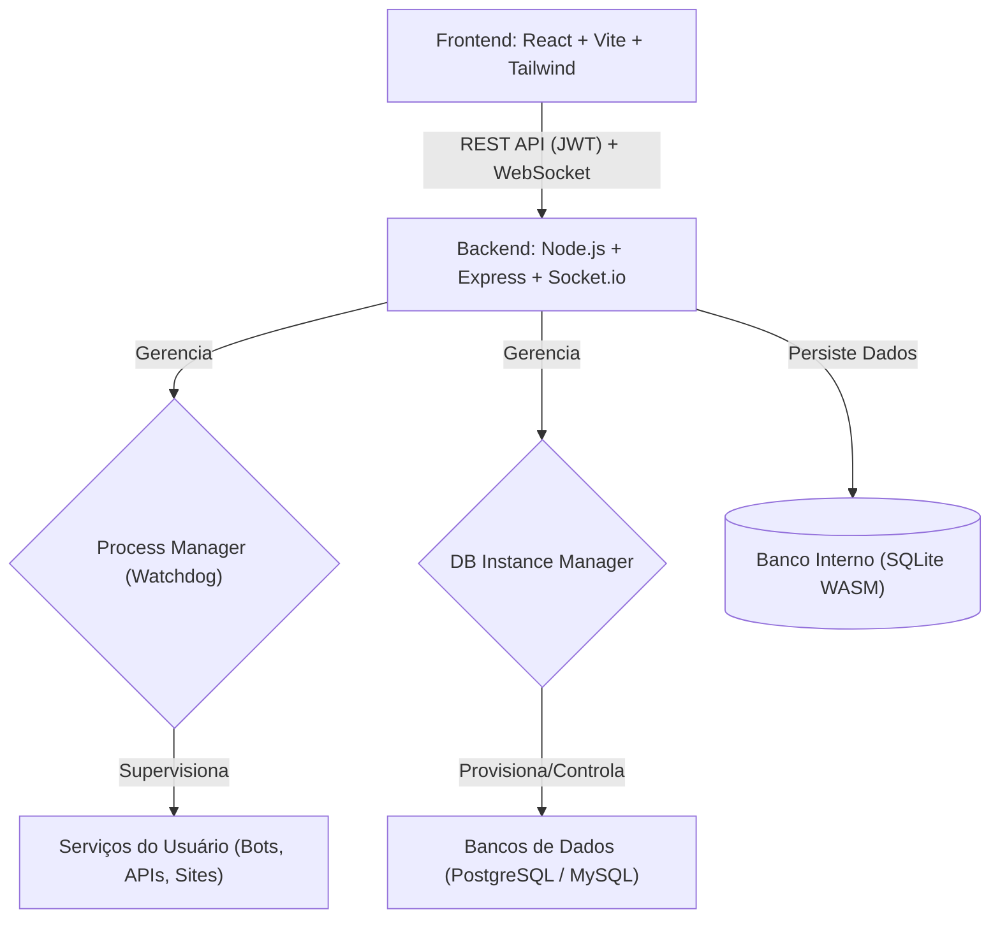

<div align="center">


# 🦖 Pterodroid

**O seu painel de hospedagem pessoal, otimizado para Android.**

[](https://github.com/theeussx/pterodroid/blob/main/LICENSE.md)[](https://nodejs.org/)[](https://reactjs.org/)[](https://tailwindcss.com/)[](https://www.sqlite.org/)

<p align="center">
<a href="#sobre-o-projeto">Sobre</a> •
    <a href="#funcionalidades-principais">Funcionalidades</a> •
    <a href="#arquitetura-do-sistema">Arquitetura</a> •
    <a href="#tecnologias-utilizadas">Tecnologias</a> •
    <a href="#guia-de-instalação">Instalação</a> •
    <a href="#configuração-inicial">Configuração</a> •
    <a href="#contribuição">Contribuição</a> •
    <a href="#licença">Licença</a>
  </p>
</div>

---

## 📖 Sobre o Projeto

O **Pterodroid** é um inovador painel de hospedagem pessoal, concebido com a inspiração do *Pterodactyl*, mas meticulosamente adaptado para operar em ambientes móveis, especificamente dentro do **Termux** ou de um **Ubuntu proot** em dispositivos Android. Este projeto se destaca por sua leveza e independência de sistemas de inicialização como o `systemd`, oferecendo uma solução robusta para gerenciar seus serviços digitais diretamente do seu smartphone ou tablet.

Com o Pterodroid, você pode facilmente hospedar e gerenciar bots de Discord, APIs personalizadas, sites estáticos e instâncias de bancos de dados, tudo através de uma interface de usuário moderna e intuitiva. É a ferramenta perfeita para desenvolvedores e entusiastas que buscam autonomia e controle sobre seus projetos em um ambiente portátil.

> [!NOTE]**Filosofia do Pterodroid:** Desenvolvido para uso **pessoal e individual**, o Pterodroid prioriza a simplicidade e a eficiência. Ele não foi projetado para multi-tenancy ou como uma plataforma de marketplace, focando em oferecer uma experiência otimizada para um único usuário.

---

## ✨ Funcionalidades Principais

Descubra o que o Pterodroid pode fazer por você:

- 🚀 **Gerenciamento Intuitivo de Processos:** Inicie, pause, reinicie e monitore seus serviços com facilidade através de um painel de controle amigável.

- 🛡️ **Watchdog Inteligente:** Um sistema de monitoramento integrado garante a resiliência dos seus serviços, reiniciando-os automaticamente em caso de falhas inesperadas, com políticas de *backoff* configuráveis.

- 🗄️ **Bancos de Dados Locais Simplificados:** Provisionamento e gerenciamento automatizado de instâncias **PostgreSQL** e **MySQL/MariaDB**, permitindo que você configure ambientes de desenvolvimento completos no seu dispositivo.

- 📈 **Monitoramento de Recursos em Tempo Real:** Acompanhe o desempenho do seu sistema com gráficos dinâmicos de uso de CPU, RAM e espaço em disco, fornecendo insights valiosos sobre a saúde dos seus serviços.

- 📝 **Visualização de Logs ao Vivo:** Acesse os logs de console (stdout/stderr) dos seus serviços em tempo real, facilitando a depuração e o acompanhamento de atividades via conexão WebSockets.

- 🔒 **Segurança Robusta:** Autenticação de usuário baseada em JWT (JSON Web Tokens) com validade de 7 dias e armazenamento seguro de senhas utilizando o algoritmo `bcryptjs`.

- 📱 **Experiência Otimizada para Dispositivos Móveis:** Uma interface de usuário responsiva, construída com Tailwind CSS, que se adapta perfeitamente a telas de diferentes tamanhos, garantindo uma experiência consistente em smartphones e tablets.

---

## 🏗️ Arquitetura do Sistema

O Pterodroid adota uma arquitetura de **Supervisor-Filho**, onde o componente de backend atua como o orquestrador central. Ele é responsável por gerenciar diretamente todos os processos de serviço e banco de dados, eliminando a dependência de ferramentas externas como `pm2` ou `systemd`, o que é crucial para a compatibilidade em ambientes Android.



---

## 🛠️ Tecnologias Utilizadas

O desenvolvimento do Pterodroid foi guiado pela escolha estratégica de tecnologias que garantem alta compatibilidade e desempenho em ambientes com recursos limitados, como o Termux, evitando dependências de compilação nativa (C++).

| Camada / Componente | Tecnologia(s) | Justificativa e Benefícios |
| --- | --- | --- |
| **Frontend** | React, Vite, Tailwind CSS v3 | Interface de usuário moderna e reativa. Vite para builds rápidos. Tailwind v3 para estilização eficiente e compatibilidade com ARM (evita `oxide` do v4). |
| **Backend** | Node.js, Express, Socket.io | Ambiente JavaScript unificado. Express para API RESTful. Socket.io para comunicação em tempo real (logs e status). |
| **Banco de Dados Interno** | SQLite via `sql.js` (WASM) | Solução de banco de dados leve e totalmente compatível com Termux, sem necessidade de `node-gyp` para compilação nativa. |
| **Gerenciamento de Processos** | `child_process` do Node.js | Controle direto sobre os processos dos serviços, com monitoramento de stdout/stderr e reinício automático. |
| **Autenticação** | JWT, `bcryptjs` | Segurança robusta para autenticação de usuários e hashing de senhas, sem dependências nativas. |
| **Ícones** | `lucide-react` | Biblioteca de ícones leve, modular e otimizada para React, sem dependências nativas. |
| **Bancos Gerenciados** | PostgreSQL, MySQL/MariaDB | Suporte para os principais sistemas de gerenciamento de banco de dados, provisionados como processos filhos diretos para integração simplificada. |

---

## 🚀 Guia de Instalação

Siga os passos abaixo para configurar o Pterodroid no seu dispositivo Android.

### 1. Preparação do Ambiente (Termux)

Certifique-se de que o Termux esteja instalado e atualizado em seu dispositivo. Em seguida, instale as dependências essenciais:

```bash
pkg update && pkg upgrade -y
pkg install git nodejs-lts -y
```

### 2. Clonagem e Instalação do Pterodroid

Clone o repositório do Pterodroid e execute o script de instalação:

```bash
git clone https://github.com/theeussx/pterodroid.git
cd pterodroid
chmod +x install-termux.sh panelctl.sh
./install-termux.sh
```

### 3. Iniciando o Painel

Após a instalação, você pode iniciar o painel de controle com o seguinte comando:

```bash
./panelctl.sh start
```

Para acessar a interface web, abra seu navegador e navegue até: `http://localhost:3001`

> [!TIP]Se você estiver acessando de outro dispositivo na mesma rede Wi-Fi, substitua `localhost` pelo endereço IP do seu dispositivo Android (ex: `http://<ip-do-celular>:3001` ).

---

## ⚙️ Configuração Inicial

### Credenciais Padrão

Ao primeiro acesso, utilize as seguintes credenciais:

- **Usuário:** `admin`

- **Senha:** `admin`

> [!WARNING]É **altamente recomendável** alterar a senha padrão imediatamente após o primeiro login, através da seção de configurações do painel.

### Persistência em Segundo Plano no Android

Para garantir que o Pterodroid e seus serviços continuem funcionando em segundo plano no Android, mesmo quando o Termux não está em foco, siga estas recomendações:

1. **Instale o Termux:API:** `pkg install termux-api -y`

1. **Ative o Wake Lock:** Execute `termux-wake-lock` em uma sessão do Termux antes de iniciar o painel. Isso impede que o sistema Android suspenda o Termux para economizar bateria.

1. **Otimização de Bateria:** Desative as otimizações de bateria para o aplicativo Termux nas configurações do seu Android. Isso evita que o sistema encerre o processo do Termux de forma agressiva.

---

## 🤝 Contribuição

Sua colaboração é muito bem-vinda! Se você tem ideias, encontrou um bug ou deseja adicionar uma nova funcionalidade, sinta-se à vontade para contribuir.

1. **Faça um Fork** do projeto para o seu próprio repositório.

1. **Crie uma nova Branch** para sua feature ou correção: `git checkout -b feature/minha-nova-feature`.

1. **Realize suas alterações** e comente-as de forma clara e concisa.

1. **Envie suas alterações** para o seu repositório: `git push origin feature/minha-nova-feature`.

1. **Abra um Pull Request** para o repositório principal, descrevendo suas mudanças.

---

## 📄 Licença

Este projeto é distribuído sob a **Licença MIT**. Para mais detalhes, consulte o arquivo `LICENSE` no repositório.

<div align="center">

  Feito com ❤️ por <a href="https://github.com/theeussx">Matheus</a>
</div>
