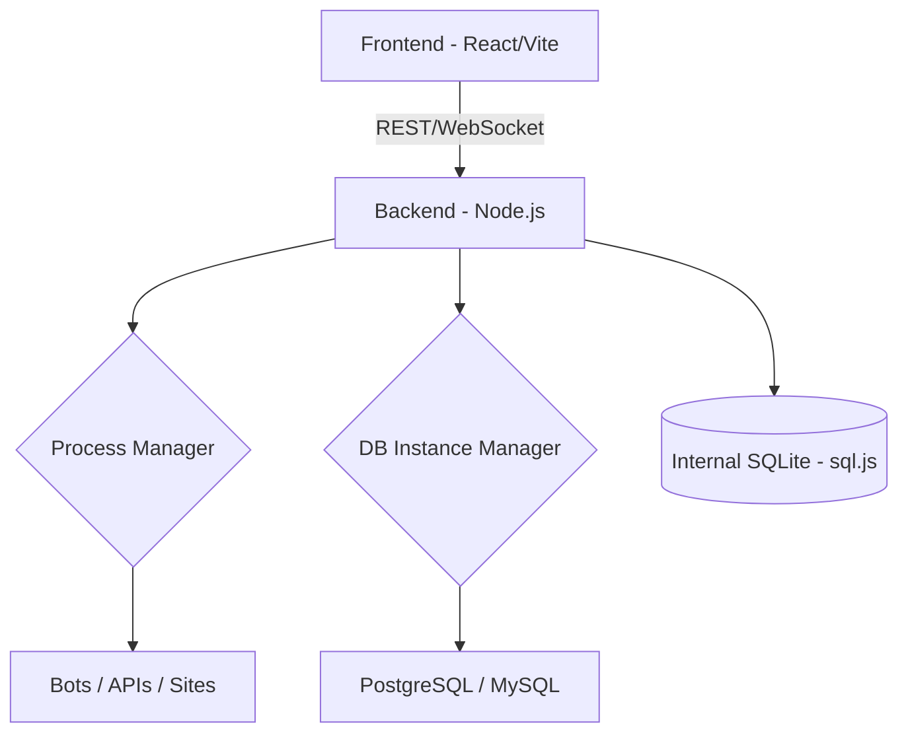

<div align="center">


# 🦖 Pterodroid

**O seu painel de hospedagem pessoal para Android.**

[](https://github.com/theeussx/pterodroid/blob/main/LICENSE)[](https://nodejs.org/)[](https://reactjs.org/)[](https://tailwindcss.com/)[](https://www.sqlite.org/)

<p align="center">
<a href="#-sobre">Sobre</a> •
    <a href="#-funcionalidades">Funcionalidades</a> •
    <a href="#-arquitetura">Arquitetura</a> •
    <a href="#-instalação">Instalação</a> •
    <a href="#-tecnologias">Tecnologias</a>
  </p>
</div>

---

## 📖 Sobre

O **Pterodroid** é um painel de hospedagem pessoal, fortemente inspirado no *Pterodactyl*, projetado especificamente para rodar dentro do **Termux** ou de um **Ubuntu proot** no Android.

Diferente de painéis tradicionais, o Pterodroid foi construído para ser leve e independente de `systemd`, permitindo que você gerencie bots de Discord, APIs, sites e bancos de dados diretamente do seu dispositivo móvel com uma interface moderna e intuitiva.

> [!IMPORTANT]**Foco do Projeto:** Uso pessoal, single-user, sem multi-tenancy e sem marketplace. Simplicidade e eficiência no Android.

---

## ✨ Funcionalidades

- 🚀 **Gerenciamento de Processos:** Inicie, pare e reinicie seus serviços com um clique.

- 🔄 **Watchdog Integrado:** Monitoramento contínuo que reinicia serviços automaticamente em caso de falha.

- 🗄️ **Bancos de Dados Locais:** Provisionamento automático de instâncias **PostgreSQL** e **MySQL/MariaDB**.

- 📊 **Monitoramento em Tempo Real:** Acompanhe o uso de CPU, RAM e Disco através de gráficos dinâmicos.

- 📝 **Logs ao Vivo:** Visualize a saída do console (stdout/stderr) em tempo real via WebSockets.

- 🔐 **Segurança:** Autenticação via JWT e armazenamento seguro de senhas com BCrypt.

- 📱 **Otimizado para Mobile:** Interface responsiva construída com Tailwind CSS.

---

## 🏗️ Arquitetura

O Pterodroid utiliza uma arquitetura de **Supervisor-Filho**, onde o backend atua como o gestor direto de todos os processos, eliminando a necessidade de ferramentas externas como o `pm2` ou `systemd`.



---

## 🛠️ Tecnologias

O projeto foi cuidadosamente planejado para evitar dependências que exigem compilação nativa (C++), garantindo compatibilidade total com o ambiente limitado do Termux.

| Camada | Tecnologia | Por que? |
| --- | --- | --- |
| **Frontend** | React + Tailwind v3 | Estabilidade e performance em ARM. |
| **Backend** | Node.js + Express | Ecossistema maduro para gestão de processos. |
| **Real-time** | Socket.io | Logs fluidos sem polling. |
| **Banco Interno** | SQLite (WASM) | Roda em qualquer lugar sem `node-gyp`. |
| **Ícones** | Lucide React | Leve e tree-shakeable. |

---

## 🚀 Instalação

### 1. Preparando o Ambiente (Termux)

Certifique-se de ter o Termux instalado e atualizado.

```bash
pkg update && pkg upgrade
pkg install git nodejs-lts
```

### 2. Clonando e Instalando

```bash
git clone https://github.com/theeussx/pterodroid.git
cd pterodroid
chmod +x install-termux.sh panelctl.sh
./install-termux.sh
```

### 3. Iniciando o Painel

```bash
./panelctl.sh start
```

Acesse no seu navegador: `http://localhost:3001`

---

## ⚙️ Configuração Inicial

- **Login Padrão:**
  - Usuário: `admin`
  - Senha: `admin`

- **Persistência no Android:**Para evitar que o Android mate o processo do painel, recomenda-se:
    1. Instalar o `termux-api`.
    1. Executar `termux-wake-lock`.
    1. Desativar a otimização de bateria para o Termux.

---

## 🤝 Contribuição

Contribuições são sempre bem-vindas! Sinta-se à vontade para abrir **Issues** ou enviar **Pull Requests**.

1. Faça um Fork do projeto.

1. Crie uma Branch para sua feature (`git checkout -b feature/NovaFeature` ).

1. Comente suas alterações.

1. Faça o Push da Branch (`git push origin feature/NovaFeature`).

1. Abra um Pull Request.

---

## 📄 Licença

Distribuído sob a licença MIT. Veja `LICENSE` para mais informações.

<div align="center">
Feito com ❤️ por <a href="https://github.com/theeussx">Mateus</a>
</div>
