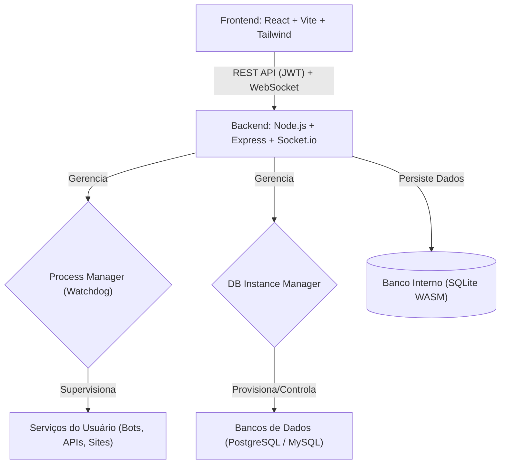

<div align="center">


# 🦖 Pterodroid

**O seu painel de hospedagem pessoal, otimizado para Android.**

[](https://github.com/theeussx/pterodroid/blob/main/LICENSE.md)[](https://nodejs.org/)[](https://reactjs.org/)[](https://tailwindcss.com/)[](https://www.sqlite.org/)

<p align="center">
<a href="#sobre-o-projeto">Sobre</a> •
    <a href="#funcionalidades-principais">Funcionalidades</a> •
    <a href="#arquitetura-do-sistema">Arquitetura</a> •
    <a href="#tecnologias-utilizadas">Tecnologias</a> •
    <a href="#guia-de-instalação">Instalação</a> •
    <a href="#configuração-inicial">Configuração</a> •
    <a href="#contribuição">Contribuição</a> •
    <a href="#licença">Licença</a>
  </p>
</div>

---

## 📖 Sobre o Projeto

O **Pterodroid** é um inovador painel de hospedagem pessoal, concebido com a inspiração do *Pterodactyl*, mas meticulosamente adaptado para operar em ambientes móveis, especificamente dentro do **Termux** ou de um **Ubuntu proot** em dispositivos Android. Este projeto se destaca por sua leveza e independência de sistemas de inicialização como o `systemd`, oferecendo uma solução robusta para gerenciar seus serviços digitais diretamente do seu smartphone ou tablet.

Com o Pterodroid, você pode facilmente hospedar e gerenciar bots de Discord, APIs personalizadas, sites estáticos e instâncias de bancos de dados, tudo através de uma interface de usuário moderna e intuitiva. É a ferramenta perfeita para desenvolvedores e entusiastas que buscam autonomia e controle sobre seus projetos em um ambiente portátil.

> [!NOTE]**Filosofia do Pterodroid:** Desenvolvido para uso **pessoal e individual**, o Pterodroid prioriza a simplicidade e a eficiência. Ele não foi projetado para multi-tenancy ou como uma plataforma de marketplace, focando em oferecer uma experiência otimizada para um único usuário.

---

## ✨ Funcionalidades Principais

Descubra o que o Pterodroid pode fazer por você:

- 🚀 **Gerenciamento Intuitivo de Processos:** Inicie, pause, reinicie e monitore seus serviços com facilidade através de um painel de controle amigável.

- 🛡️ **Watchdog Inteligente:** Um sistema de monitoramento integrado garante a resiliência dos seus serviços, reiniciando-os automaticamente em caso de falhas inesperadas, com políticas de *backoff* configuráveis.

- 🌐 **Acesso Remoto via Cloudflare Tunnel:** Acesse o painel de qualquer lugar, sem precisar estar na mesma rede Wi-Fi, e exponha publicamente os sites/APIs que você hospedar — tudo com um clique, sem conta na Cloudflare.

- 🔌 **Alocação Automática de Portas:** Se a porta escolhida para um serviço já estiver em uso, o painel encontra a próxima disponível automaticamente e injeta o valor real via variável de ambiente `PORT`.

- 📁 **Containers de Projeto:** Ao criar um serviço sem apontar para uma pasta existente, o painel cria automaticamente um diretório dedicado em `~/pterodroid-projects/`, prontinho para você colocar seu código.

- 🗄️ **Bancos de Dados Locais Simplificados:** Provisionamento e gerenciamento automatizado de instâncias **PostgreSQL** e **MySQL/MariaDB**, permitindo que você configure ambientes de desenvolvimento completos no seu dispositivo.

- 📈 **Monitoramento de Recursos em Tempo Real:** CPU, RAM, disco, rede (download/upload) e temperatura (quando o dispositivo expõe sensores), com histórico em gráficos leves.

- 📝 **Logs ao Vivo com Filtros:** Tail em tempo real com filtro por nível (info/warn/error/debug), busca textual, pausar/retomar, copiar, limpar, e separadores automáticos por dia.

- 📂 **Gerenciador de Arquivos Completo:** Navegue, crie, edite, renomeie, mova, copie e exclua arquivos e pastas direto do painel — upload por arrastar-e-soltar, editor de texto embutido para configs/scripts, busca por nome, seleção múltipla para ações em lote, e log de auditoria das ações.

- 🔒 **Segurança Robusta:** Autenticação de usuário baseada em JWT (JSON Web Tokens) com validade de 7 dias, segredo gerado e persistido automaticamente no primeiro boot, armazenamento seguro de senhas utilizando o algoritmo `bcryptjs`, e o gerenciador de arquivos restrito a uma raiz configurável (nunca a todo o sistema).

- 📱 **Experiência Otimizada para Dispositivos Móveis:** Interface responsiva com sidebar recolhível, indicador de conexão em tempo real, e uma experiência consistente em smartphones e tablets.

---

## 🏗️ Arquitetura do Sistema

O Pterodroid adota uma arquitetura de **Supervisor-Filho**, onde o componente de backend atua como o orquestrador central. Ele é responsável por gerenciar diretamente todos os processos de serviço e banco de dados, eliminando a dependência de ferramentas externas como `pm2` ou `systemd`, o que é crucial para a compatibilidade em ambientes Android.



---

## 🌐 Acesso Remoto (Cloudflare Tunnel)

O painel usa [Cloudflare Tunnel](https://developers.cloudflare.com/cloudflare-one/networks/connectors/cloudflare-tunnel/do-more-with-tunnels/trycloudflare/) no modo **Quick Tunnel** — sem precisar de conta na Cloudflare nem de domínio próprio. Isso gera uma URL pública aleatória (`https://algo-aleatorio.trycloudflare.com`) que redireciona para um serviço local.

### Acesso remoto ao painel

Em **Configurações → Acesso Remoto**, ative para gerar uma URL pública do painel inteiro. Assim dá pra acessar de qualquer lugar, incluindo de outro celular, sem estar na mesma rede Wi-Fi.

> [!WARNING]
> Essa URL não tem autenticação própria — qualquer pessoa com o link chega até a tela de login do painel. **Troque a senha padrão antes de ativar isso.** O painel te avisa se você ainda não trocou.

### Expondo um serviço (site/API)

Ao criar ou editar um serviço, preencha o campo **Porta**. Assim que o serviço iniciar:
- Se a porta já estiver em uso, o painel escolhe automaticamente a próxima disponível.
- A porta final é injetada como variável de ambiente `PORT` no processo — frameworks como Express, Flask, FastAPI etc. já leem essa variável por padrão.
- Um túnel é aberto automaticamente e a URL pública aparece no card do serviço assim que o cloudflared conecta (alguns segundos).

> [!NOTE]
> A URL muda a cada reinício do serviço — Quick Tunnels não têm domínio fixo. Se você precisa de uma URL estável, crie um [Named Tunnel](https://developers.cloudflare.com/cloudflare-one/networks/connectors/cloudflare-tunnel/) com um domínio seu na Cloudflare (`cloudflared tunnel login` → `cloudflared tunnel create` → `cloudflared tunnel route dns`), e aponte o `CLOUDFLARED_BIN`/config manualmente — isso foge do escopo de "um clique" do painel, mas é totalmente compatível com o cloudflared já instalado.

### Por que bancos de dados não têm essa opção no acesso rápido

Quick Tunnels só carregam tráfego **HTTP/HTTPS**. O protocolo binário do PostgreSQL ou do MySQL não passa por esse tipo de túnel — por isso a opção simples de acesso remoto não oferece isso para bancos. Só é possível com um domínio próprio (veja abaixo), e mesmo assim com uma ressalva importante.

### Domínio personalizado

Se você já tem conta na Cloudflare com um domínio adicionado como zona, dá pra usar um domínio de verdade em vez da URL aleatória — em **Configurações → Domínio personalizado**. Duas formas de configurar, mostradas lado a lado no painel; elas não rodam ao mesmo tempo (é sempre um processo cloudflared só).

#### Opção A — Túnel gerenciado pelo painel (CLI)

Totalmente automatizado, incluindo os registros DNS:

1. **Autentique o cloudflared** — precisa ser feito manualmente, uma vez só, em um terminal:
   ```bash
   cloudflared tunnel login
   ```
   Isso abre o navegador para você entrar na sua conta. O painel detecta automaticamente quando isso foi feito.

2. **Crie o túnel nomeado** — um clique no painel (`cloudflared tunnel create`, feito por trás dos panos).

3. **Configure os domínios** — o domínio base (ex: `meudominio.com`) e o domínio do painel em Configurações; o domínio de cada serviço/banco no formulário dele. Digitar só um nome (`site1`) usa o domínio base automaticamente; digitar um domínio completo usa exatamente o que foi digitado.

4. **Aplique** — regenera a configuração, cria os registros DNS (CNAME) automaticamente via `cloudflared tunnel route dns`, e reinicia o túnel.

> [!WARNING]
> Como é **um único processo** cloudflared com várias regras de roteamento, aplicar uma mudança reinicia esse processo inteiro, interrompendo brevemente **todos** os domínios configurados, não só o que mudou.

#### Opção B — Colar token do dashboard Cloudflare

Alternativa mais simples de colocar pra funcionar, e o caminho recomendado se o fluxo de login por CLI der problema no seu aparelho (alguns ambientes Android/Termux têm restrições que atrapalham esse fluxo interativo). Crie o túnel direto pelo [dashboard Zero Trust](https://one.dash.cloudflare.com/) (Networks → Tunnels → Create a tunnel → Cloudflared), que te dá um comando parecido com:

```bash
cloudflared tunnel --no-autoupdate run --token eyJhIjoi...
```

Cole só o token (a parte depois de `--token`) no painel, em Configurações → Opção B. O painel roda e supervisiona esse processo — reinício automático incluso — mas o roteamento de cada domínio para sua porta local é feito **no dashboard**, na aba "Public Hostname" do túnel, não pelos campos de domínio dos formulários de serviço/banco (esses são específicos da Opção A).

**Sobre bancos de dados com domínio personalizado:** tecnicamente possível em ambas as opções (Named Tunnel suporta roteamento TCP: `service: tcp://localhost:5432`), mas conectar não é tão simples quanto abrir uma URL. O dispositivo que for acessar o banco também precisa ter o cloudflared instalado e rodar:
```bash
cloudflared access tcp --hostname banco1.meudominio.com --url 127.0.0.1:5432
```
Só depois disso um cliente Postgres/MySQL local (`127.0.0.1:5432`) realmente alcança o banco remoto. É mais trabalho que abrir um site no navegador, mas funciona de verdade — diferente do acesso rápido, que nunca funcionaria para bancos.

---

## 📂 Gerenciador de Arquivos

Navegue, edite e envie arquivos direto do painel, sem precisar sair para o gerenciador de arquivos do Android.

### Raiz restrita, não o sistema todo

Todo o acesso é limitado a uma única raiz configurável (`FILES_ROOT`, padrão: `$HOME` do Termux) — nunca o sistema de arquivos inteiro. Isso importa especialmente agora que o painel pode estar acessível pela internet (acesso remoto acima): mesmo que alguém chegasse até a tela de login, o gerenciador de arquivos não tem como escapar dessa raiz.

Toda operação (listar, ler, escrever, mover, copiar, excluir) passa por uma única função de validação de caminho, que:
- rejeita `../` que tentem escapar da raiz
- rejeita caminhos absolutos passados como se fossem relativos
- resolve links simbólicos e verifica se o destino real também está dentro da raiz (um link pode estar dentro da pasta permitida mas apontar pra fora)

### Editor de texto

Arquivos até 2MB reconhecidos como texto (`.js`, `.json`, `.yml`, `.env`, `.md`, etc.) abrem no editor embutido — `Ctrl+S` salva. Arquivos maiores ou detectados como binários (heurística: byte nulo nos primeiros 8KB) não abrem no editor; use o download.

### Auditoria

Toda ação que cria, altera, move, copia, exclui ou envia um arquivo fica registrada (usuário, ação, caminho, quando) — visível em Arquivos → ícone de histórico.

---

## 🛠️ Tecnologias Utilizadas

O desenvolvimento do Pterodroid foi guiado pela escolha estratégica de tecnologias que garantem alta compatibilidade e desempenho em ambientes com recursos limitados, como o Termux, evitando dependências de compilação nativa (C++).

| Camada / Componente | Tecnologia(s) | Justificativa e Benefícios |
| --- | --- | --- |
| **Frontend** | React, Vite, Tailwind CSS v3 | Interface de usuário moderna e reativa. Vite para builds rápidos. Tailwind v3 para estilização eficiente e compatibilidade com ARM (evita `oxide` do v4). |
| **Backend** | Node.js, Express, Socket.io | Ambiente JavaScript unificado. Express para API RESTful. Socket.io para comunicação em tempo real (logs e status). |
| **Banco de Dados Interno** | SQLite via `sql.js` (WASM) | Solução de banco de dados leve e totalmente compatível com Termux, sem necessidade de `node-gyp` para compilação nativa. |
| **Gerenciamento de Processos** | `child_process` do Node.js | Controle direto sobre os processos dos serviços, com monitoramento de stdout/stderr e reinício automático. |
| **Autenticação** | JWT, `bcryptjs` | Segurança robusta para autenticação de usuários e hashing de senhas, sem dependências nativas. Segredo JWT gerado e persistido automaticamente (`data/.jwt-secret`) se não configurado via `.env`. |
| **Configuração** | `dotenv` | Leitura de `backend/.env` (veja `.env.example`) para porta, segredo JWT, diretórios de dados e projetos. Tudo opcional — funciona com zero configuração. |
| **Acesso Remoto** | `cloudflared` (Quick + Named Tunnels) | Exposição pública do painel e de serviços via Cloudflare Tunnel — URL aleatória sem conta, ou domínio próprio para quem já tem uma conta Cloudflare configurada. |
| **Ícones** | `lucide-react` | Biblioteca de ícones leve, modular e otimizada para React, sem dependências nativas. |
| **Upload de arquivos** | `multer` | Upload multipart direto para o destino validado, sem etapa intermediária de cópia. Puro JS, sem dependência nativa. |
| **Bancos Gerenciados** | PostgreSQL, MySQL/MariaDB | Suporte para os principais sistemas de gerenciamento de banco de dados, provisionados como processos filhos diretos para integração simplificada. |

---

## 🚀 Guia de Instalação

Siga os passos abaixo para configurar o Pterodroid no seu dispositivo Android.

### 1. Preparação do Ambiente (Termux)

Certifique-se de que o Termux esteja instalado e atualizado em seu dispositivo. Em seguida, instale as dependências essenciais:

```bash
pkg update && pkg upgrade -y
pkg install git nodejs-lts -y
```

### 2. Clonagem e Instalação do Pterodroid

Clone o repositório do Pterodroid e execute o script de instalação:

```bash
git clone https://github.com/theeussx/pterodroid.git
cd pterodroid
chmod +x install-termux.sh panelctl.sh
./install-termux.sh
```

### 3. Iniciando o Painel

Após a instalação, você pode iniciar o painel de controle com o seguinte comando:

```bash
./panelctl.sh start
```

Para acessar a interface web, abra seu navegador e navegue até: `http://localhost:3001`

> [!TIP]Se você estiver acessando de outro dispositivo na mesma rede Wi-Fi, substitua `localhost` pelo endereço IP do seu dispositivo Android (ex: `http://<ip-do-celular>:3001` ).

---

## ⚙️ Configuração Inicial

### Credenciais Padrão

Ao primeiro acesso, utilize as seguintes credenciais:

- **Usuário:** `admin`

- **Senha:** `admin`

> [!WARNING]É **altamente recomendável** alterar a senha padrão imediatamente após o primeiro login, através da seção de configurações do painel.

### Persistência em Segundo Plano no Android

Para garantir que o Pterodroid e seus serviços continuem funcionando em segundo plano no Android, mesmo quando o Termux não está em foco, siga estas recomendações:

1. **Instale o Termux:API:** `pkg install termux-api -y`

1. **Ative o Wake Lock:** Execute `termux-wake-lock` em uma sessão do Termux antes de iniciar o painel. Isso impede que o sistema Android suspenda o Termux para economizar bateria.

1. **Otimização de Bateria:** Desative as otimizações de bateria para o aplicativo Termux nas configurações do seu Android. Isso evita que o sistema encerre o processo do Termux de forma agressiva.

---

## 🐛 Correções desta atualização

**Nova nesta versão:** gerenciador de arquivos completo (navegação, editor, upload por arrastar-e-soltar, mover/copiar/excluir em lote, busca, auditoria), logs com filtro por nível/pausa/cópia/agrupamento por dia, monitoramento com rede e temperatura, sidebar com indicador de conexão real e modo recolhido.

Testado de ponta a ponta (backend real, Postgres e MariaDB reais, cloudflared real) antes de entregar. Encontrado e corrigido:

- **Arquivo inexistente retornava erro 500 em vez de 404** no gerenciador de arquivos — corrigido para toda operação que faz `stat` num caminho que pode legitimamente não existir (leitura, mover, copiar).

- **Banco de dados não iniciava:** o `portFinder.js` escutava o evento `'listen'`, mas o Node emite `'listening'` — toda vez que uma porta estava livre (o caso normal), a checagem travava para sempre. Como toda instância de banco tem porta obrigatória, nenhuma nunca chegava a iniciar.
- **"Baixe o banco" mesmo já instalado:** a checagem de binários usava `which`, que não vem instalado por padrão no Termux. Trocado por `command -v` (builtin do shell, sempre disponível) com um scan manual do `$PATH` como reforço.
- **`config.js` com erro de sintaxe:** faltava uma vírgula, o que impedia o backend de sequer iniciar.
- **Risco de crash do painel inteiro:** o `tunnelManager` não tinha handler para o evento `'error'` do processo filho — se o `cloudflared` não estivesse instalado, o Node derrubava o processo inteiro (não só a tentativa de túnel). Corrigido com tratamento de erro adequado.
- **Migração de schema:** novas colunas (`port`, `public_url`, etc.) agora são adicionadas via `ALTER TABLE` a um banco já existente, em vez de só funcionarem em um banco novo. Seu `panel.db` atual é migrado automaticamente, sem perda de dados, na primeira vez que você rodar essa versão.
- **Exposição de banco de dados via túnel rápido removida:** Quick Tunnels só suportam HTTP, então essa opção nunca funcionaria de verdade para Postgres/MySQL. Agora só é oferecida via domínio personalizado (Named Tunnel + `cloudflared access tcp` do lado de quem conecta) — veja a seção de Acesso Remoto acima.
- **Novo: domínio personalizado (Named Tunnel):** configuração de domínio próprio para o painel, serviços e bancos, direto pela interface, com criação de túnel e registros DNS automatizados. Descoberto e corrigido no processo: `--config` é uma opção do comando pai `tunnel` e precisa vir *antes* do subcomando `run` (`cloudflared tunnel --config X run NOME`), não depois — só validado rodando contra o binário real.
- **Novo: modo token (dashboard Cloudflare):** alternativa ao fluxo por CLI acima — cole o token de um túnel criado direto no dashboard Zero Trust e o painel supervisiona o processo. Mais confiável em ambientes Android/Termux onde o login interativo por CLI pode não completar direito.
- **Corrigido: domínio do painel "sumia" ao recarregar a página** — o formulário sempre resetava o campo para vazio ao carregar o status, mesmo com um valor já salvo no backend (só o preview calculado aparecia, não o campo em si).

---

## 🤝 Contribuição

Sua colaboração é muito bem-vinda! Se você tem ideias, encontrou um bug ou deseja adicionar uma nova funcionalidade, sinta-se à vontade para contribuir.

1. **Faça um Fork** do projeto para o seu próprio repositório.

1. **Crie uma nova Branch** para sua feature ou correção: `git checkout -b feature/minha-nova-feature`.

1. **Realize suas alterações** e comente-as de forma clara e concisa.

1. **Envie suas alterações** para o seu repositório: `git push origin feature/minha-nova-feature`.

1. **Abra um Pull Request** para o repositório principal, descrevendo suas mudanças.

---

## 📄 Licença

Este projeto é distribuído sob a **Licença MIT**. Para mais detalhes, consulte o arquivo `LICENSE` no repositório.

<div align="center">

  Feito com ❤️ por <a href="https://github.com/theeussx">Matheus</a>
</div>
